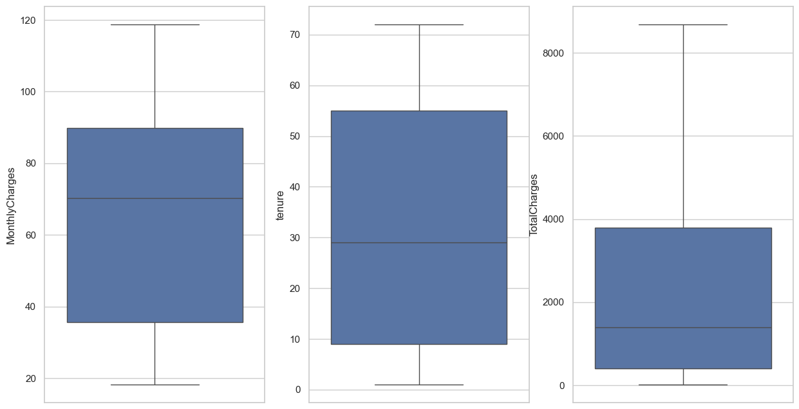
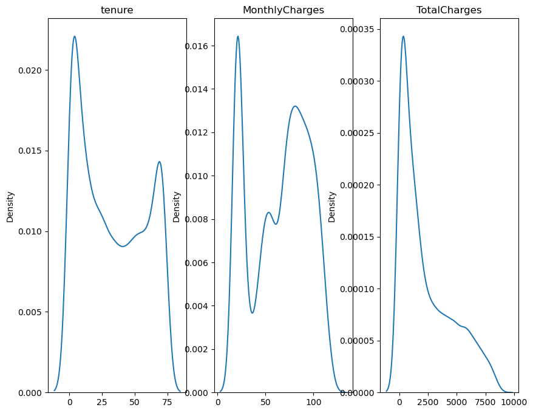

# Telco Customer Churn Prediction

This project is an end to end machine learning system designed to predict customer attrition for a telecommunications company. By analyzing customer behavior and demographics, the system identifies individuals at risk of leaving, allowing for proactive retention strategies.

The project covers the entire data science lifecycle, from initial data cleaning to model evaluation and final deployment.

---

## Tech Stack

 **Language:** Python (3.10+ recommended)
 **Core Libraries:** `pandas`, `numpy`, `scikit-learn`, `imbalanced-learn`, `xgboost`, `matplotlib`, `seaborn`, `scipy`
 **Environment Management:** `uv` + virtual environment + `requirements.txt`
 **Visualization & Deployment:** Tableau Dashboard and a Webapp deployed via Heroku

----

### Dataset Details

The system uses a dataset named `Telco-Customer-Churn.csv` which contains information on telecom customers and their key behaviors.

**Features Include:**
 **Demographics:** `gender`, `SeniorCitizen`, `Partner`, `Dependents`
 **Services:** `PhoneService`, `MultipleLines`, `InternetService`, `OnlineSecurity`, `OnlineBackup`, `DeviceProtection`, `TechSupport`, `StreamingTV`, `StreamingMovies`
 **Account Info:** `tenure` (weeks), `Contract`, `PaperlessBilling`, `PaymentMethod`, `MonthlyCharges`, `TotalCharges`
 **Target Variable:** `Churn` (Indicates if the customer stayed or churned)

---

###  Data Overview
We analyzed the distribution of customer demographics and service usage to identify patterns in churn.

*This visualization shows the breakdown of gender, contract types, and the overall churn rate of 26.6%.*

###  Distribution of Charges and Tenure
The following density plots show how tenure and monthly charges are distributed across the dataset.

*Key observation: Tenure shows a bimodal distribution, indicating a mix of new and long-term customers.*

###  Statistical Analysis
Boxplots were used to check for outliers in numerical features before model training.

*Monthly and Total charges show a wide spread but remain within expected ranges for the telco industry.*

## Model & Results
The project evaluates multiple models, including Logistic Regression and XGBoost, to predict the Churn target variable.

**Performance**: The Logistic Regression model achieved an accuracy of 80% on the test dataset.

---

##  License
This project is licensed under the **MIT License** - see the [LICENSE](LICENSE) file for details.
